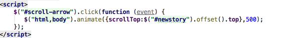
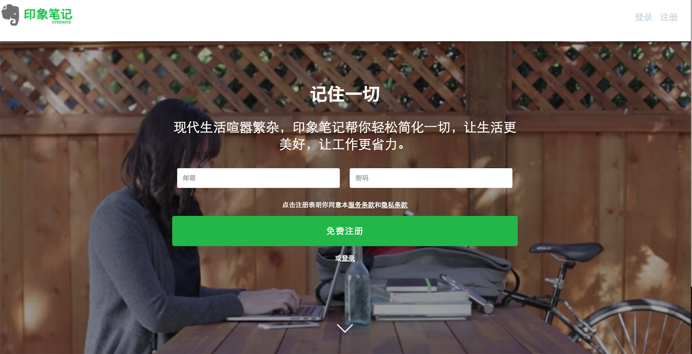

##Day1
* 几个需要注意的元素
 * box-sizing:border-box 将border的长度算进padding的值中
 * overflow:hidden 将超出width的部分隐藏起来
 * line－height 是指行高
 * display: inline-block 行内元素，可以将列表转为水平
 * letter－spacing:字间距
 * text-decoration:字体样式
 * ul 或者 ol 中list-style:none 可以将列表的样式去除

* 几个小技巧
 * 保证垂直居中的方法：line-height设置与height的值相等
 * 保证水平居中的方法：margin: 0 auto 
 * 居中的另一种方式：top:50% left:50%
    transform:translate（－50%，－50%）(负为左，水平位置，负为上，垂直位置)
 * 跳转页面的方式：

  * css文件：全局清除样式normalize／common普通样式／特殊样式
 

* 几个快捷键
  * command+shift+N google隐藏模式
  * command＋shift＋P 在submline下下载
  
  *paskage controll 再下载package 就可以使用jtools工具栏下压缩／解压缩 文件*
  
  今天的成果：
  
  
  ##明天需要完成的任务：
  
  1.看jquery的动画部分 （3）
 
  2.看css3中的data－action等内容 （2）
  
  3.完成表单验证部分，并且模仿另一个网页（4）
  
  4.熟悉 html 类似于position的元素   （1）
  
 
    
    



