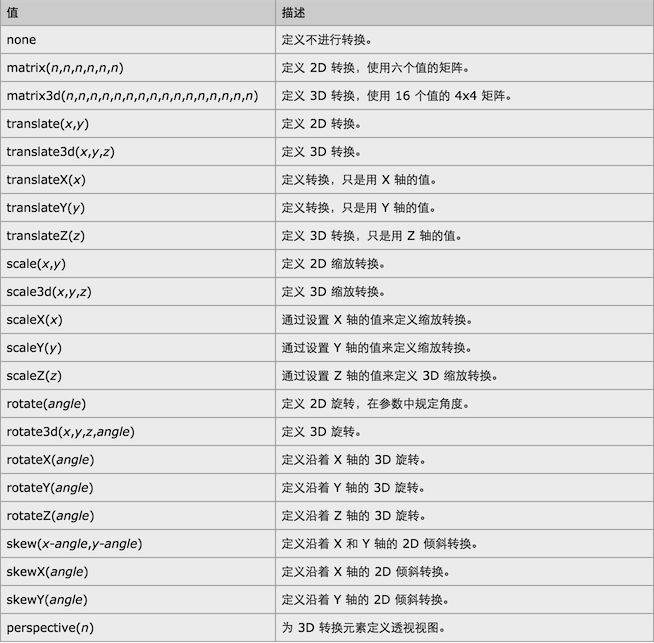

###事件冒泡
在页面上有多个事件，也可以多个元素响应同一个事件，之所以称为冒泡，是因为事件会按照dom的层次结构像水泡一样不断向上直至顶端：
 
  * 事件对象和停止事件冒泡
  或者 `return false`
  
  
     
  *  事件捕获
  事件捕获和事件冒泡是刚好相反的两个过程，事件捕获是从最顶端往下开始触发。
  
###tab页面实现的基本思路：
  一个单选按钮后面跟一个label[tab头]，在后面跟上一个div[tab内容块]
  
  用.radio:checked + .tab-header指定当前tab头的样式
  
  用.radio:checked + .tab-header + .tab-content指定当前tab内容块的样式(指定被选择后的样式)
  
###关于position的介绍

设置相应的position属性后top，left等才会生效

###关于transform和transition
transform属性允许我们对元素进行旋转、缩放、移动和转移。

transition可以设置简单的动画效果

* transition-property 需要动画效果的属性
* transition-duration 持续时间
* transition-timing-function 速度效果的速度时间
* transition-delay 定义过度效果何时开始

###inline-block的居中方式
将元素设置成inline－block后margin方式的居中不生效；
可以设置父元素的text－align：center

参照如下：[六种居中方式](https://www.w3cplus.com/css/elements-horizontally-center-with-css.html)

###day3的主要任务：
1.实现轮播图及点击后左右滑动效果
2.airbnb下方的图片排列
3.jquery 教程

  