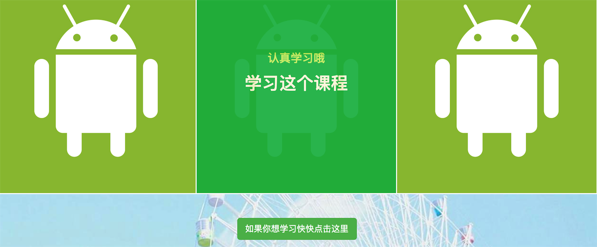

###day3小结
1.学习HTML 的标签及元素，以及H5添加的新元素；

2.学习响应式布局；

3.初步使用bootstrap搭建简单的分屏应用：

（1）注意文件链入是有先后顺序的；bootstrap.js是依赖jquery的，因此先链入jquery.js。

（2）背景图片设置 `position：absolute `才能浮动在文本内容的下方；

（3）bootstrap的姗格的使用：
```
   class＝“row”
   col-md-*(1-12)
   ```

初步的样式：





