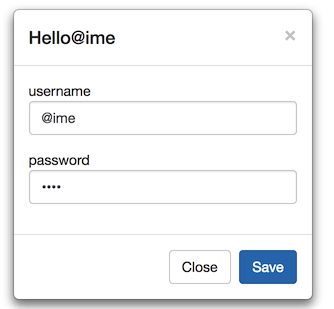
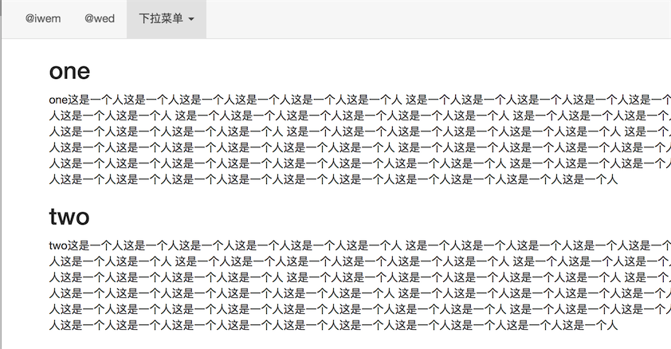
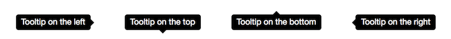
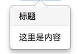

###bootstrap js插件学习
####1.简单的过渡效果学习

Transition.js 是针对 transitionEnd 事件的一个基本辅助工具，也是对 CSS 过渡效果的模拟。它被其它插件用来检测当前浏览器对是否支持 CSS 的过渡效果。

在js文件后面添加如下代码，可以禁用过渡效果：
`
$.support.transition = false
`


####2.模态框

模态框：用户是否能对其他对象进行响应是模态与非模态的区别。

* 增强模态框的可读性和可访问性：
<font color=red>
务必为 `.modal` 添加 `role="dialog"` 和 `aria-labelledby="..."` 属性，用于指向模态框的标题栏；为 `.modal-dialog` 添加 `aria-hidden="true"` 属性。另外，你还应该通过 `aria-describedby` 属性为模态框 `.modal` 添加描述性信息.
</font>

* 自定义模态框尺寸的时候应该注意修改两处：
`
<div class="modal fade bs-example-modal-sm"  id="myModal" role="dialog" aria-label="myModal" aria-hidden="true">
`

` <div class="modal-dialog modal-sm">
`

* 删除过渡效果,即删除`fade`
* 通过data属性激活模态框:通过在一个起控制器作用的元素（例如：按钮）上添加 `data-toggle="modal"` 属性，或者 `data-target="#foo"` 属性，再或者 `href="#foo"` 属性，用于指向被控制的模态框。

`
<button type="button" class="btn btn-primary btn-lg"  data-toggle="modal" data-target="#myModal" data-whatever="@ime">
    点击出现
</button>
`

* 通过javascript激活：

`
$('#myModal').modal(options)
`

####3.下拉菜单
```
<div class="dropdown">
  <button id="dLabel" type="button" data-toggle="dropdown" aria-haspopup="true" aria-expanded="false">
    Dropdown trigger
    <span class="caret"></span>
  </button>
  <ul class="dropdown-menu" aria-labelledby="dLabel">
    ...
  </ul>
</div>
```
####4 滚动监听
* 一般监听`body`元素,被监听的组件需保证`position: relative`：

```
<body data-spy="scroll" data-target="#navbar-example">
  ...
  <div id="navbar-example">
    <ul class="nav nav-tabs" role="tablist">
    ...
    </ul>
  </div>
  ...
</body>

```

<cite>
When scrollspying on elements other than the <body>, be sure to have a height set and overflow-y: scroll; applied.
</cite>

* 当使用滚动监听插件的同时在 DOM 中添加或删除元素后，你需要像下面这样调用此刷新（ refresh） 方法：

```
$('[data-spy="scroll"]').each(function () {
  var $spy = $(this).scrollspy('refresh')
})
```

####5 标签页 tab.js
* 基本使用方法：

```
<div>

  <!-- Nav tabs -->
  <ul class="nav nav-tabs" role="tablist">
    <li role="presentation" class="active"><a href="#home" aria-controls="home" role="tab" data-toggle="tab">Home</a></li>
    <li role="presentation"><a href="#profile" aria-controls="profile" role="tab" data-toggle="tab">Profile</a></li>
    <li role="presentation"><a href="#messages" aria-controls="messages" role="tab" data-toggle="tab">Messages</a></li>
    <li role="presentation"><a href="#settings" aria-controls="settings" role="tab" data-toggle="tab">Settings</a></li>
  </ul>

  <!-- Tab panes -->
  <div class="tab-content">
    <div role="tabpanel" class="tab-pane active" id="home">...</div>
    <div role="tabpanel" class="tab-pane" id="profile">...</div>
    <div role="tabpanel" class="tab-pane" id="messages">...</div>
    <div role="tabpanel" class="tab-pane" id="settings">...</div>
  </div>

</div>
```
* <cite>To make tabs fade in, add `.fade` to each `.tab-pane`. The first tab pane must also have `.in` to make the <strong>initial content visible</strong>.

Copy
</cite>


####6 工具提示 toolips
* 四个方向：`data-placement="left|right|top|bottom"`
* 需要额外初始化：

```
$(function () {
  $('[data-toggle="tooltip"]').tooltip()
})
```
```
 $("[data-toggle='tooltip']").tooltip();
```


####7 弹出框
* 基本使用方式：

```
<div class="container">
    <p class="muted" style="margin-bottom: 0">
        欢迎学习<a id="myTip" href="#" data-toggle="tooltip" title="title" data-placement="left" data-original-title="www.bootstrap.com">bootstrap</a>
    </p>
</div>
```
* 由于性能的原因，工具提示和弹出框的 data 编程接口（data api）是必须要手动初始化的。
在一个页面上一次性初始化所有弹出框的方式是通过 `data-toggle` 属性选中他们：

```
$(function () {
  $('[data-toggle="popover"]').popover()
})
```
* 点击消失的方式：`
data-trigger="focus"
`

####8 按钮的样式
1.警告信息：
```<button type="button" class="close" data-dismiss="alert" aria-label="Close">
  <span aria-hidden="true">&times;</span>
</button>
```
2.状态改变：

```
<button type="button" id="myButton" data-loading-text="Loading..." class="btn btn-primary" autocomplete="off">
  Loading state
</button>

<script>
  $('#myButton').on('click', function () {
    var $btn = $(this).button('loading')
    // business logic...
    $btn.button('reset')
  })
</script>
```
3.多选为checkbox，单选为radio

####9 collapse（堆叠的样式）
折叠展开的panel：

```
 <div class="panel-group" id="accordion" role="tablist">
        <div class="panel panel-default" >
            <div class="panel-heading" role="tab" id="headingOne">
                <h4 class="panel-title">
                    <a data-toggle="collapse" data-parent="#accordion" href="#collapseOne">item1
                    </a>
                </h4>

            </div>
            <div id="collapseOne" class="panel-collapse collapse in" role="tabpanel">
                <div class="panel-body">
                    Hello
                    Hello
                    Hello
                    Hello
                    Hello
                </div>

            </div>

        </div>
        <div class="panel panel-default">
            <div class="panel-heading" role="tab" id="headingTwo">
                <h4 class="panel-title">
                    <a data-toggle="collapse" data-parent="#accordion" href="#collapseTwo">item2</a>
                </h4>
            </div>
            <div id="collapseTwo" class="panel-collapse collapse" role="tabpanel">
                <div class="panel-body">
                    Hello
                    Hello
                    Hello
                    Hello
                    Hello
                </div>
            </div>
        </div>

    </div>
```
<strong>注意`panel-group`中panel item的`data-parent`属性</strong>

####10 Carousel

* `class="carousel-indicators"`添加轮播的点：

```
<ol class="carousel-indicators">
            <li data-target="#carousel-example-generic" data-slide-to="0" class="active"></li>
            <li data-target="#carousel-example-generic" data-slide-to="1" class=""></li>
            <li data-target="#carousel-example-generic" data-slide-to="2" class=""></li>
        </ol>
```
* `carousel-inner`添加轮播图中的内容

```
 <div class="carousel-inner">
            <div class="item active">
                ...
            </div>
            <div class="item">
               ...
            </div>
            <div class="item">
                ...
            </div>

        </div>
```

* 添加左右图标(图标是去哪里？)：

```
 <a class="left carousel-control" href="#carousel-example-generic" data-slide="prev">
           <span class="glyphicon glyphicon-chevron-left"></span>
        </a>
        <a class="right carousel-control" href="#carousel-example-generic" data-slide="next">
            <span class="glyphicon glyphicon-chevron-right"></span>
        </a>
```
* 默认为5s `data－interval＝“”`


####11 affix 侧边栏停靠

* 巧妙利用栅格系统设置布局：

```
 <div class="col-md-3">
        <ul class="list-group affixed-element-top js-affixed-element-top" >
            <li class="list-group-item"></li>
            <li class="list-group-item"></li>
            <li class="list-group-item"></li>
            <li class="list-group-item"></li>
            <li class="list-group-item"></li>
            <li class="list-group-item"></li>
        </ul>
    </div>
```
* 使用javascript：

```
<script>
    $(function () {
        $(".js-affixed-element-top").affix({
            offset:{
            }
        });
        $(".js-affixed-element-bottom").affix({

        });

    })
</script>
```


